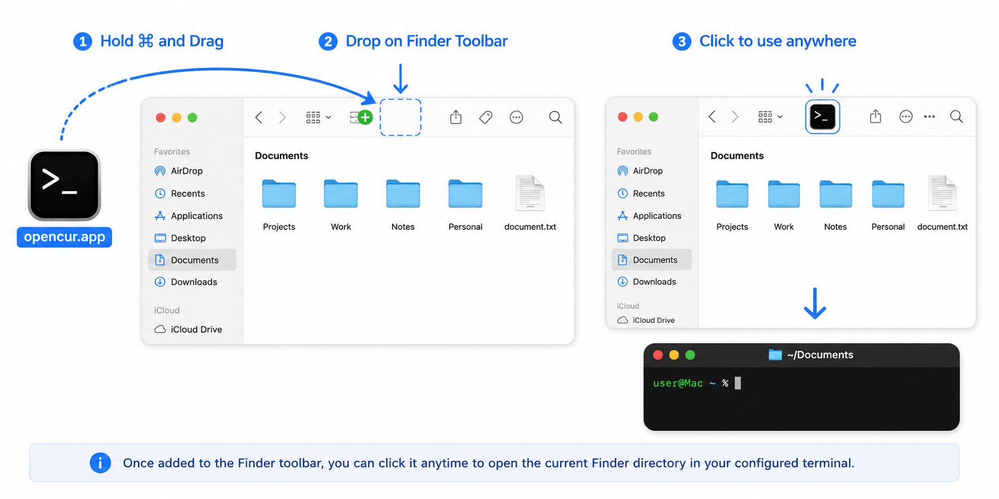

# opencur

Open the current Finder directory in your preferred terminal with a single click.

Supports:

- Terminal.app
- iTerm2
- Ghostty

## Installation

1. Download **opencur.app** from the latest GitHub Release.
2. Move it to your **Applications** folder.

## Trust

Because opencur is currently distributed without Apple notarization, macOS may prevent it from opening.

If the app is quarantined, remove the quarantine attribute:

```bash
xattr -dr com.apple.quarantine /Applications/opencur.app
```

> Only do this if you downloaded opencur from the official GitHub Releases page.

## Configuration

Set your preferred terminal:

```bash
# Terminal.app
defaults write io.github.joshaken.opencur opencur-terminal-bundle-id com.apple.Terminal

# iTerm2
defaults write io.github.joshaken.opencur opencur-terminal-bundle-id com.googlecode.iterm2

# Ghostty
defaults write io.github.joshaken.opencur opencur-terminal-bundle-id com.mitchellh.ghostty
```

Ghostty is used by default.

To restore the default setting:

```bash
defaults delete io.github.joshaken.opencur opencur-terminal-bundle-id
```

## Add to Finder Toolbar (Recommended)

For quick access from anywhere in Finder:

1. Open a Finder window.
2. Hold the **⌘ Command** key.
3. Drag **opencur.app** onto the Finder toolbar (next to the navigation buttons).
4. Release the mouse.

The icon will stay in the Finder toolbar, allowing you to open the current Finder directory in your configured terminal with a single click from any Finder window.

> See the illustration below.



## Usage

Click the **opencur** icon in the Finder toolbar.

- If a file or folder is selected, opencur opens its containing directory.
- If nothing is selected, opencur opens the current Finder window's directory.
- The directory is opened in your configured terminal.

## Requirements

- macOS 14 or later
- Finder Automation permission
- Terminal.app, iTerm2, or Ghostty